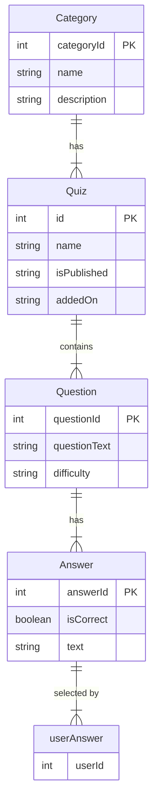

# Quizzer

What be the purpose of this undertaking?
How might one make use of this endeavor?
In what manner may one further develop this project?
Who be the contributors to this venture?

## Description of the project

Quizzer is a web application designed to help teachers (at Haaga Helia) create and manage quizzes to support student learning.
The project includes two main web-based dashboards: a teacher dashboard for quiz creation and management, and a student dashboard for quiz-taking and reviews.
The application is accessible through any browser and provides an interactive learning experience for students.

## Data model

The data model is designed to support the management of quizzes, their associated categories, questions, answer options and user interactions. The primary entities, their attributes, and relationships are as follows:

### Entities and attributes

#### Category

- **Attributes:**
  - `categoryId` (int, primary key)
  - `name` (string)
  - `description` (string)
- **Purpose:** Represents a grouping or classification for quizzes.

---

#### Quiz

- **Attributes:**
  - `id` (int, primary key)
  - `name` (string)
  - `isPublished` (string)
  - `addedOn` (string)
- **Purpose:** Represents a collection of questions that belong to a specific category.

---

#### Question

- **Attributes:**
  - `questionId` (int, primary key)
  - `questionText` (string)
  - `difficulty` (string)
- **Purpose:** Represents an individual question in a quiz.

---

#### Answer

- **Attributes:**
  - `answerId` (int, primary key)
  - `isCorrect` (boolean)
  - `text` (string)
- **Purpose:** Represents the possible answer options for a question and indicates whether an answer is correct or incorrect.

---

#### userAnswer

- **Attributes:**
  - `userId` (int)
- **Purpose:** Tracks the user's selected answer options for questions in a quiz.

---

### ERD

## Developer guide

Follow the steps below to intialize the back end application:

1. Using a Command-line interface (CLI), navigate to the the project's QuizzerBackEnd folder
2. Start the application by running the `./mvnw spring-boot:run` command
3. Once the Spring Boot app is initialized, visit <http://localhost:8080> in a web browser to add, edit, and delete quizzes, questions, and answers.

### System Requirement

Java version 17
Java version can be found in the pom.xml file in the java.version property.

## Team members

- [Alisa Dunaeva](https://github.com/dunaevaalisa)
- [Roda Henein](https://github.com/hxrda)
- [Vili Konttinen](https://github.com/ViliKon)
- [Nguyen Toan](https://github.com/tnguyen3537)
- [Emilio Lehto Neira](https://github.com/emiliolehto)

## Product backlog

https://github.com/orgs/NULL-Haaga-Helia/projects/1/views/1

## Web service URL

https://quiz-project-h7mc.onrender.com/
