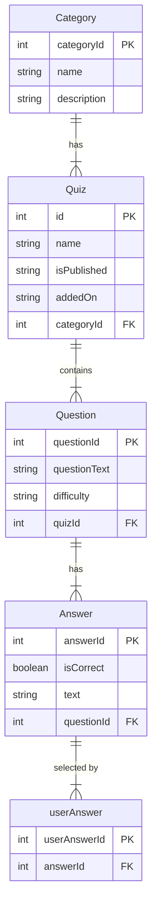

# Quizzer

What be the purpose of this undertaking?
How might one make use of this endeavor?
In what manner may one further develop this project?
Who be the contributors to this venture?

## Description of the project

Quizzer is a web application designed to help teachers (at Haaga Helia) create and manage quizzes to support student learning.
The project includes two main web-based dashboards: a teacher dashboard for quiz creation and management, and a student dashboard for quiz-taking and reviews.
The application is accessible through any browser and provides an interactive learning experience for students.

## Project Architecture

The project architecture consists of three key components:

- **Frontend**: A ReactJS application that interacts with the backend via REST API calls. It provides the user interface for interacting with quizzes, questions, and answers.
- **Backend**: A Spring Boot application that handles business logic, manages data interaction, and serves as a REST API provider. It processes requests from the frontend and communicates with the database.
- **Database**: The project's database stores quizzes, questions, and answers. H2 is used for local development, while PostgreSQL is used for production deployment.

The architecture ensures a clear separation of responsibilities and emphasizes distinct roles of each system component, with the frontend handling user interactions, the backend managing logic and data, and the database storing and retrieving information.

### Architecture Diagram (TBA)

## Data model

The data model is designed to support the management of quizzes, their associated categories, questions, answer options and user interactions. The primary entities, their attributes, and relationships are as follows:

### Entities and attributes

#### Category

- **Attributes:**
  - `categoryId` (int, primary key)
  - `name` (string)
  - `description` (string)
- **Purpose:** Represents a grouping or classification for quizzes.

---

#### Quiz

- **Attributes:**
  - `id` (int, primary key)
  - `name` (string)
  - `isPublished` (string)
  - `addedOn` (string)
  - `categoryId` (int, foreign key)
- **Purpose:** Represents a collection of questions that belong to a specific category.

---

#### Question

- **Attributes:**
  - `questionId` (int, primary key)
  - `questionText` (string)
  - `difficulty` (string)
  - `quizId` (int, foreign key)
- **Purpose:** Represents an individual question in a quiz.

---

#### Answer

- **Attributes:**
  - `answerId` (int, primary key)
  - `isCorrect` (boolean)
  - `text` (string)
  - `questionId` (int, foreign key)
- **Purpose:** Represents the possible answer options for a question and indicates whether an answer is correct or incorrect.

---

#### userAnswer

- **Attributes:**
  - `userAnswerId` (int, primary key)
  - `abswerId` (int, foreign key)
- **Purpose:** Tracks the user's selected answer options for questions in a quiz.

---

### ERD

## Developer guide

### Frontend

1. To start the frontend application:

- Navigate to the frontend directory of the application (e.g., QuizzerFrontEnd) in your CLI (e.g. powershell)
- Install dependencies using: `npm install`
- Start the application in development environment with: `npm run dev`
- Access the application in your browser at <http://localhost:5173>.

2. Technologies used:

- Programming Language: JavaScript
- Frameworks: ReactJS (Vite)
- Major Libraries: Material-UI (MUI), React Router (react-router-dom)

### Backend

1. To intialize the back end application:

- Using a Command-line interface (CLI), navigate to the the project's QuizzerBackEnd folder
- Start the application by running the `./mvnw spring-boot:run` command
- Once the Spring Boot app is initialized, visit <http://localhost:8080> in a web browser to add, edit, and delete quizzes, questions, and answers.

2. Technologies used:

- Programming Language: Java
- Frameworks: Spring Boot, MVC (Model-View-Controller)
- Major Libraries: Thymeleaf, Maven, Bootstrap, H2

### Database

- Development Environment: H2 Database
- Production Environment: PostgreSQL

### System Requirements

#### Backend

- Java version 17: Java version can be found in the pom.xml file in the java.version property.
- Maven: Required to build and run the Spring Boot application.

#### Frontend

- Node.js: Version 18 or later (required to run the Vite development server and manage dependencies).You can check your Node.js version with the command: node -v
- npm: Comes bundled with Node.js (used to install project dependencies and run the application).

## REST API documentation URL

http://localhost:8080/v3/api-docs

NOTE: need to run the application on your device before you can access the REST API documentation

## Team members

- [Alisa Dunaeva](https://github.com/dunaevaalisa)
- [Roda Henein](https://github.com/hxrda)
- [Vili Konttinen](https://github.com/ViliKon)
- [Nguyen Toan](https://github.com/tnguyen3537)
- [Emilio Lehto Neira](https://github.com/emiliolehto)

## Product backlog

https://github.com/orgs/NULL-Haaga-Helia/projects/1/views/1

## Web service URL

https://quiz-project-h7mc.onrender.com/
